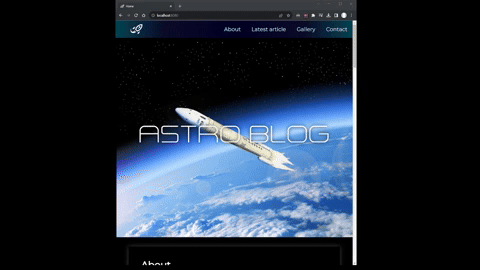

## The objective of this project is to create a SPA (single page application) of any topic using frontend technologies


---

### 1. Installation

Download this repository and run these commands in the terminal at location of your downloaded project

```

npm init -y
npm i express

```
### 2. Starting localhost

After correctly installing run the server with command

```

node server.js

```
The port is set up in the <i>server.js</i> file and by default is set to :8080

## Showcase

The project implements parallax effect and lazy loading.


